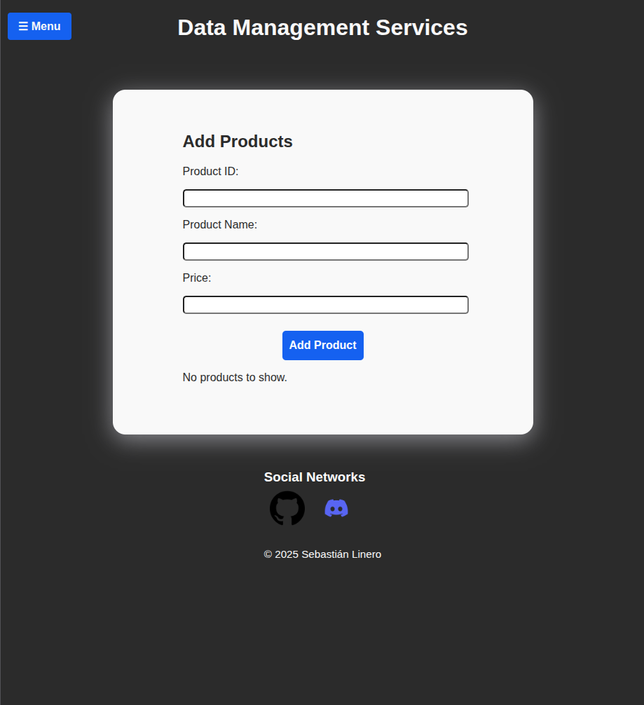
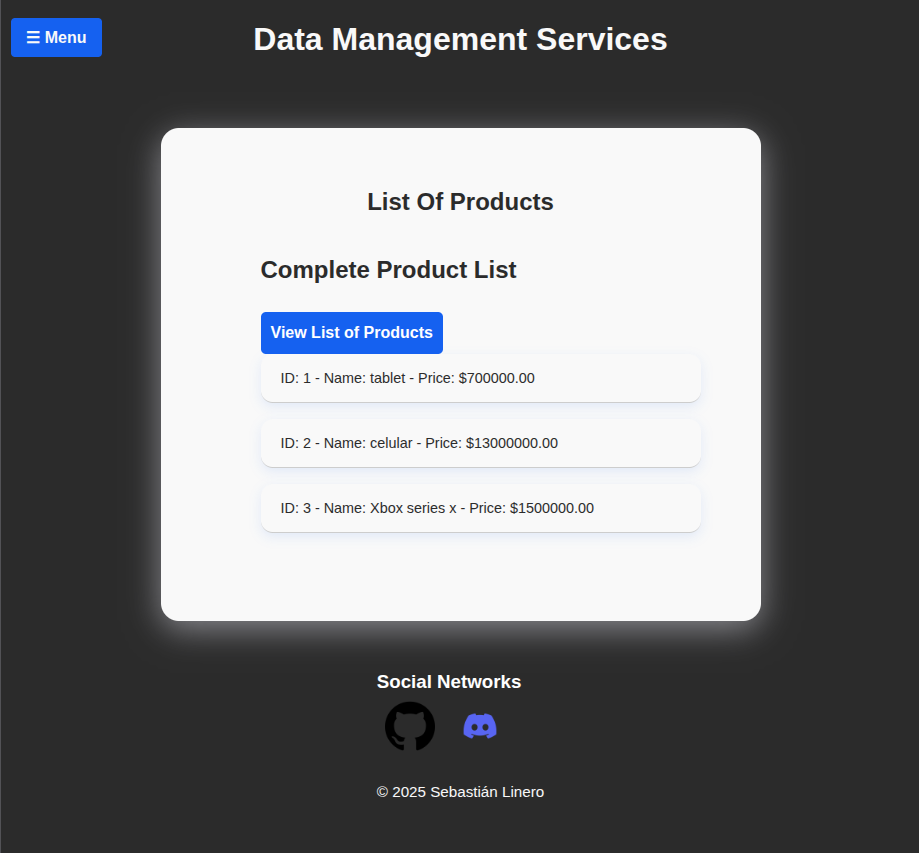

# Object-Oriented Data Management Inventory System

This project is designed to strengthen skills in managing advanced data structures using JavaScript. The solution implements **Objects**, **Sets**, and **Maps** to design, manipulate, and validate product data while applying best coding practices and efficient iteration methods.

---

## 🚀 Features

- Manage products with unique identifiers, names, and prices.
- Prevent duplicate product entries.
- Store and associate additional product information.
- Validate and iterate over product data using:
  - `for...in` for object properties.
  - `for...of` for Sets.
  - `Map.forEach()` for descriptive category listings.
- Responsive and intuitive user interface built with HTML5 and CSS3.
- Fast and efficient development workflow using Vite.

---

## 📸 Screenshots

> **Add your screenshots here for better visualization.**
>
> Example:
>
> | Add Product Page | Product List Page |
> |------------------|------------------|
> |  |  |
>
> Place your images in `src/img/` and update the filenames above.

---

## 🗂️ Project Structure

```
DATA-MANAGER/
├── node_modules/               # Project dependencies (generated by npm)
├── public/                     # Public assets accessible directly
├── src/                        # Main source code of the project
│   ├── css/
│   │   └── style.css           # Main stylesheet
│   ├── img/                    # Image assets used in the project
│   │   ├── discordLogo.png
│   │   ├── logo.png
│   │   ├── logoGithub.png
│   │   └── (add your screenshots here)
│   ├── dataManagement.js       # Data management logic
│   ├── main.js                 # Main application script
│   └── pages/                  # HTML pages for the application
│       ├── addProduct.html
│       ├── contact.html
│       ├── editProduct.html
│       ├── listProducts.html
│       └── removeProduct.html
├── .gitignore                  # Files and folders ignored by Git
├── index.html                  # Entry HTML file
├── package.json                # Project metadata and dependencies
├── package-lock.json           # Lockfile for dependency versions
├── vite.config.js              # Vite configuration
└── README.md                   # Project documentation
```

---

## 📋 Product Data Table Example

| ID  | Name        | Price   |
|-----|-------------|---------|
| 1   | Laptop      | $800    |
| 2   | Smartphone  | $500    |
| 3   | Tablet      | $300    |

---

## 🛠️ How to Use

1. **Install dependencies:**  
   ```bash
   npm install
   ```

2. **Run the development server:**  
   ```bash
   npm run dev
   ```

3. **Build for production:**  
   ```bash
   npm run build
   ```

4. **Preview the production build:**  
   ```bash
   npm run preview
   ```

---

## 📚 Technologies Used

- JavaScript (ES6+)
- Vite (development server and build tool)
- HTML5 / CSS3
- DOM Manipulation
- Advanced data structures: `Object`, `Set`, `Map`

---

## 🧩 Main Components

| File/Folder         | Description                                 |
|---------------------|---------------------------------------------|
| `src/pages/`        | HTML pages for each feature                 |
| `src/css/style.css` | Main stylesheet for the UI                  |
| `src/img/`          | Images and icons (add screenshots here)     |
| `src/dataManagement.js` | Product data logic and storage         |
| `src/main.js`       | Main JS entry point, event handlers         |

---

## 👤 Author & Contact

- **Author:** Sebastian Linero De Castro
- **Email:** sebastianlinero15@gmail.com  
- **GitHub:** [github.com/SlineroDC](https://github.com/SlineroDC)  

---

Feel free to contribute or open issues for any improvements or bugs!


